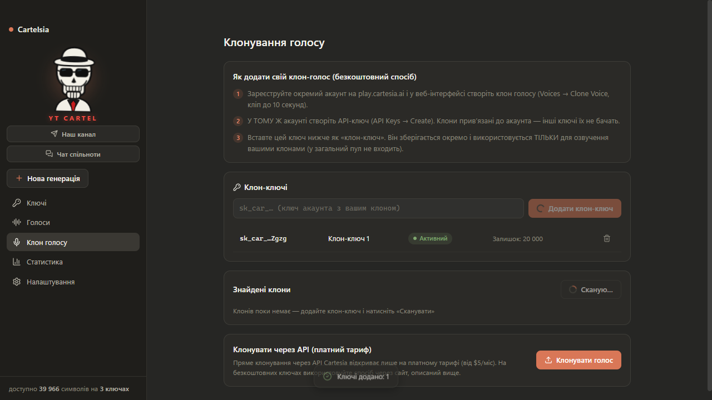
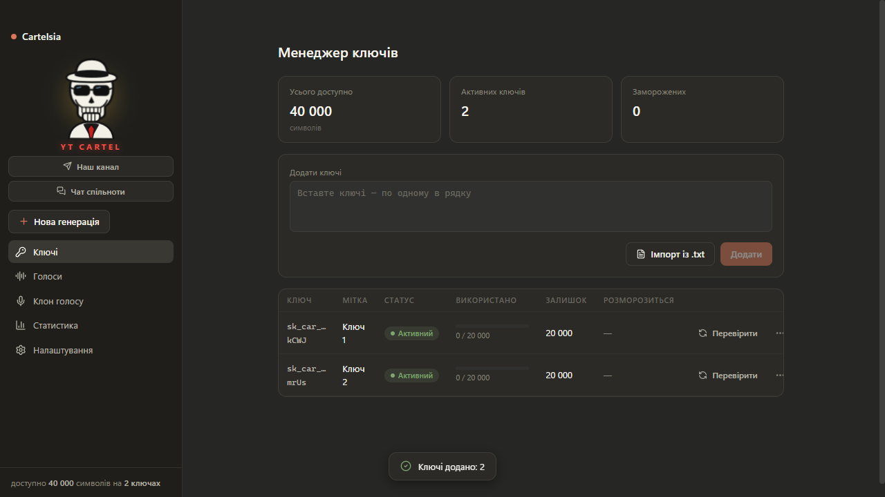

<div align="center">


# Cartelsia

**Озвучення тексту через [Cartesia AI](https://cartesia.ai) з пулом API-ключів**
Українською · темна тема у стилі Claude · portable

[](https://github.com/gitkalenyuk/cartelsia/releases/latest)
[](https://github.com/gitkalenyuk/cartelsia/releases/latest)
[](https://www.electronjs.org/)

### 📥 [**Завантажити останню версію**](https://github.com/gitkalenyuk/cartelsia/releases/latest)

*Один .exe файл, без інсталяції. Скачали → запустили → вставили ключі → озвучуєте.*

<a href="https://t.me/+e_g6IwDlVhg4OGJi">💀 Телеграм-канал YT CARTEL</a> · <a href="https://t.me/+Jj06Fbj8-8oyZDQ6">💬 Чат спільноти</a>

</div>

---


## Можливості

| | |
|---|---|
| 🔑 **Пул ключів** | Скільки завгодно безкоштовних ключів Cartesia (20 000 симв./міс кожен): вручну, списком, із `.txt`, drag&drop. Авто-перевірка валідності при додаванні |
| ❄️ **Розумна заморозка** | Вичерпаний ключ морозиться рівно на **+1 місяць** з датою/часом розморозки. Авто-розморозка + ручна проба генерацією (~1 символ) |
| 📦 **Best-fit розподіл** | Фрагмент на 500 симв. не влазить у ключ із залишком 300? Ключ пропускається, але «добивається» меншими фрагментами. Локальний лічильник лімітів (Cartesia не віддає залишок по API) |
| ⚡ **Паралельна генерація** | 2 потоки на ключ (ліміт Cartesia) × кількість ключів. Авто-ретрай ×3 з ротацією ключів — помилки не витрачають кредити |
| 💬 **Чати-історія** | Кожна генерація — чат. Фрагменти з власними плеєрами, редагування тексту, переозвучка з **версіями** (v1/v2, вибір кращої), плейліст «Відтворити все» |
| 🎧 **Склейка** | «Завантажити все» → один MP3/WAV з опційною тишею між фрагментами. Авто-склейка після завершення |
| 🗣 **Голоси** | Пошук, фільтри за мовою (🇺🇦 прапорці) і статтю, вибране ⭐. **Семпл на кожному голосі** — оригінальний або згенерований фразою мовою голосу |
| 🎭 **Клони голосів** | Окрема вкладка: клон робиться безкоштовно на сайті Cartesia → API-ключ того ж акаунта додається як «клон-ключ». Сканування клонів по всіх ключах одним кліком |
| 📝 **Субтитри** | Субтитр-режим із таймкодами слів → експорт SRT/VTT |
| 📊 **Статистика** | Споживання по днях і ключах за 30 днів, історія генерацій |
| 🔔 **Сповіщення** | Системне повідомлення + звук після завершення черги |

## Скріншоти

| Композер | Менеджер ключів |
|---|---|
|  |  |

| Клон голосу | Сайдбар YT CARTEL |
|---|---|
|  |  |

## Швидкий старт

1. **[Скачайте](https://github.com/gitkalenyuk/cartelsia/releases/latest) `Cartelsia-x.x.x-portable.exe`** і покладіть у окрему папку (поруч створяться `data/` і `output/`).
2. Перший запуск: SmartScreen попередить про непідписаний файл → **«Докладніше» → «Виконати все одно»**. Розпакування триває кілька секунд.
3. Вкладка **Ключі** → вставте ключі Cartesia (по одному в рядку) → **Додати**.
   Ключі беруться на [play.cartesia.ai](https://play.cartesia.ai) → API Keys (безкоштовний тариф = 20 000 символів/місяць).
4. **Нова генерація** → оберіть голос (▷ — послухати семпл) → вставте текст → **Озвучити**.
5. Прослухайте фрагменти, переозвучте невдалі, натисніть **«Завантажити все»** — отримаєте один файл.

> ⚠️ Ключі зберігаються **відкритим текстом** у `data/keys.json` поруч із exe — не передавайте цю папку стороннім.

## Свій клон голосу (безкоштовно)

Пряме клонування через API Cartesia відкриває лише на платному тарифі, **але через сайт — безкоштовно**:

1. Зареєструйте окремий акаунт на [play.cartesia.ai](https://play.cartesia.ai) і створіть клон у веб-інтерфейсі (Voices → Clone, кліп до 10 сек).
2. У **тому ж** акаунті створіть API-ключ (клони привʼязані до акаунта — інші ключі їх не бачать).
3. У Cartelsia відкрийте вкладку **«Клон голосу»** → вставте цей ключ як клон-ключ → **«Сканувати клони»**.

Клон-ключі зберігаються окремо від загального пулу і використовуються тільки для озвучення своїми клонами.

## Розробка

```bash
git clone https://github.com/gitkalenyuk/cartelsia.git
cd cartelsia
npm install
npm run dev          # dev-режим із HMR
```

| Команда | Що робить |
|---|---|
| `npm run typecheck` | перевірка типів (main + renderer) |
| `npm test` | unit-тести (vitest): chunker, пул ключів, scheduler, wav |
| `npm run smoke` | реальні виклики Cartesia (потрібен `keys.local.json`) |
| `npm run e2e` | Playwright E2E: повний цикл від ключів до склейки |
| `npm run build:win` | portable .exe → `dist/` |

`keys.local.json` (у `.gitignore`): `{ "keys": ["sk_car_...", "..."] }`

Збірка під macOS: на Mac — `electron-vite build && electron-builder --mac` (додати `mac.target: dmg` в `electron-builder.yml`).

## Архітектура

- **main** (`src/main`) — всі виклики Cartesia (ключі не потрапляють у вікно), пул ключів із заморозкою, черга-scheduler із best-fit розподілом, персистентність JSON, протокол `media://` для стрімінгу аудіо, SRT/VTT, сповіщення.
- **renderer** (`src/renderer`) — React + zustand, склейка аудіо через Web Audio + lamejs (без ffmpeg), запис із мікрофона, семпл-плеєр.
- **API**: `Cartesia-Version: 2026-03-01` · `POST /tts/bytes` (mp3/wav) · `POST /tts/sse` (таймкоди слів) · `GET/POST /voices*` · `POST /access-token` (безкоштовна перевірка ключів).

Перевірені на живому API нюанси: залишок кредитів недоступний через API (ведеться локальний лічильник зі звіркою по `quota_exceeded`); семпли голосів вимагають авторизації; API-клонування на фрі-тарифі повертає `plan_upgrade_required`.

---

<div align="center">

**💀 YT CARTEL** · [Канал](https://t.me/+e_g6IwDlVhg4OGJi) · [Чат](https://t.me/+Jj06Fbj8-8oyZDQ6)

</div>
