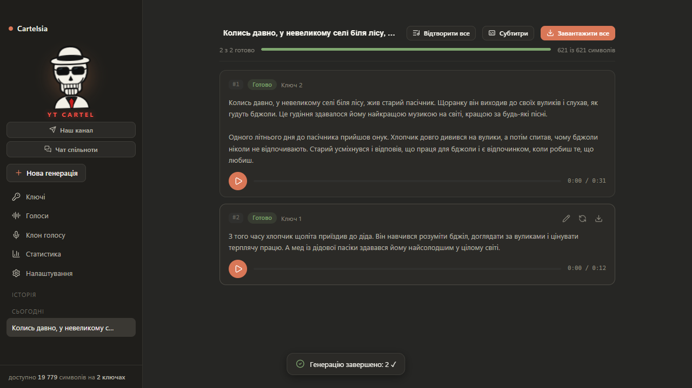
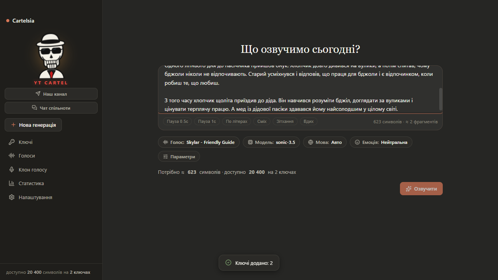
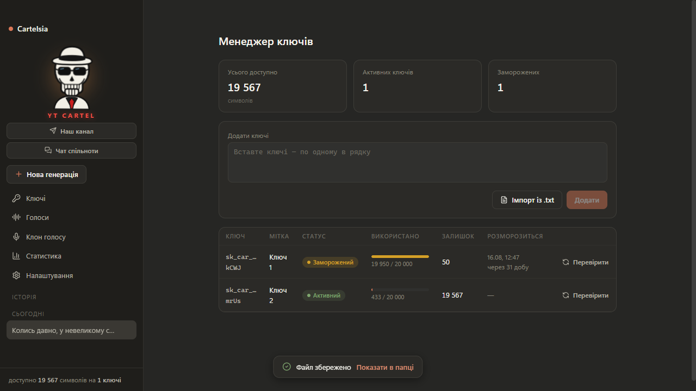

<div align="center">


# Cartelsia 2.0

**Озвучення тексту через [Cartesia AI](https://cartesia.ai) з пулом API-ключів + автареєстрація акаунтів нового покоління**
Українською · темна тема у стилі Claude · portable · безкоштовно

[](https://github.com/gitkalenyuk/cartelsia/releases/latest)
[](https://github.com/gitkalenyuk/cartelsia/releases/latest)
[](https://github.com/gitkalenyuk/cartelsia/releases)
[](https://www.electronjs.org/)

### 📥 [**Завантажити Cartelsia 2.0**](https://github.com/gitkalenyuk/cartelsia/releases/latest) · 🌐 [**Сайт з документацією**](https://gitkalenyuk.github.io/cartelsia/)

*Один .exe файл, без інсталяції. Скачали → запустили → вставили ключі → озвучуєте.*
*Потрібно багато ключів? Автореєстрація 2.0 створює до 25 акаунтів одночасно — сама, з ключами.*

<a href="https://t.me/+e_g6IwDlVhg4OGJi">💀 Телеграм-канал YT CARTEL</a> · <a href="https://t.me/+Jj06Fbj8-8oyZDQ6">💬 Чат спільноти</a>

</div>

---

## 🆕 Що нового у 2.0 (коротко)

| | |
|---|---|
| 🧠 **Новий рушій реєстрації** | Стара схема «чистий Clerk API» **померла**: Cartesia увімкнула silent-block — email верифікується, але акаунт не створюється. Тепер реєстрація йде через **справжню форму в headless Chromium** (Vercel-checkpoint проходить автоматично) — так, як реальний користувач |
| ⚡ **До 25 потоків** | Персистентний пул воркерів: завершив акаунт → пауза → наступний. На весь прогін рівно N одночасних реєстрацій |
| 🔑 **Ключі одразу** | Грабляться **в тому ж браузерному сеансі** одразу після реєстрації (окремий логін неможливий — Clerk флагує як suspicious). Пишуться в `api_keys.txt` + пул |
| 🛟 **Rescue-прохід** | Акаунти «без ключа» після прогону автоматично проходять повторний /keys через збережені сесії — жоден акаунт не втрачається |
| 🌐 **Проксі 2.0** | Окрема вкладка: імпорт `ip:port:user:pass`, чек, ротація. Проксі, що дала **2 фейли підряд**, сама видаляється з ротації |
| 📨 **Прямий IMAP OTP** | Кожен запит — свіже з'єднання + серверний пошук по заголовку `To` (~3 с). Стійкий до «мовчазних» backend-ів Gmail |
| 🎨 **Редизайн** | Inter + JetBrains Mono, градієнтний акцент, анімовані картки, shimmer-прогрес, живий лог реєстрації в UI, тултіпи `?` на кожному параметрі |

Повний звіт: [RELEASE_NOTES_2.0.0.md](RELEASE_NOTES_2.0.0.md)

---



## Можливості

| | |
|---|---|
| 🔑 **Пул ключів** | Скільки завгодно безкоштовних ключів Cartesia (20 000 симв./міс кожен): вручну, списком, із `.txt`, drag&drop. Авто-перевірка валідності при додаванні |
| ❄️ **Розумна заморозка** | Вичерпаний ключ морозиться до 1-го числа наступного місяця. Авто-розморозка + ручна проба генерацією (~1 символ) |
| 📦 **Best-fit розподіл** | Фрагмент на 500 симв. не влазить у ключ із залишком 300? Ключ пропускається, але «добивається» меншими фрагментами. Локальний лічильник лімітів |
| ⚡ **Паралельна генерація** | 2 потоки на ключ (ліміт Cartesia) × кількість ключів. Авто-ретрай ×3 з ротацією ключів |
| 💬 **Чати-історія** | Кожна генерація — чат. Фрагменти з плеєрами, редагування, переозвучка з версіями, плейліст |
| 🎧 **Склейка** | «Завантажити все» → один MP3/WAV з опційною тишею між фрагментами |
| 🗣 **Голоси** | Пошук, фільтри за мовою і статтю, вибране ⭐, семпл на кожному голосі |
| 🎭 **Клони голосів** | Безкоштовне клонування через сайт → клон-ключ окремо від пулу |
| 🤖 **Автореєстрація 2.0** | **До 25 одночасних** реєстрацій у headless Chromium, до 2000 акаунтів за прогін. Живий лог, proxy penalty, rescue для «без ключа» |
| 📝 **Субтитри** | Субтитр-режим із таймкодами слів → експорт SRT/VTT |
| 📊 **Статистика** | Споживання по днях і ключах за 30 днів |

## Скріншоти

| Композер | Менеджер ключів |
|---|---|
|  |  |

---

## Швидкий старт

1. **[Скачайте](https://github.com/gitkalenyuk/cartelsia/releases/latest) `Cartelsia-2.0.0-portable.exe`** у окрему папку (поруч створяться `data/` і `output/`).
2. SmartScreen попередить про непідписаний файл → **«Докладніше» → «Виконати все одно»**.
3. **Ключі** → вставте наявні ключі або одразу переходьте до Автореєстрації.
4. **Нова генерація** → голос → текст → **Озвучити**.

> ⚠️ Ключі зберігаються відкритим текстом у `data/` поруч із exe — не передавайте папку стороннім.

---

## Автореєстрація 2.0 — повний гайд

### Обмеження і цифри

| Параметр | Значення | Чому так |
|---|---|---|
| Потоків максимум | **25** | Понад 25 Clerk/Vercel починають rate-limit (HTTP 429) — реєстрації ламаються масово. Комфортно: **5–15** |
| Акаунтів за прогін | **до 2000** | Пул воркерів: потік завершив — через паузу бере наступний |
| Пауза між акаунтами | 2.5–5.5 с (дефолт) | Антифрод; після кожної задачі потік відпочиває |
| Час одного акаунта | 50–90 с | Checkpoint 6–10 с + форма + OTP 5–20 с + /keys |
| OTP таймаут | 170 с | Лист може затриматись під навантаженням |
| Проксі | необов'язково, але рекомендовано | Див. нижче |
| Proxy penalty | 2 фейли підряд = видалення | Успіх скидає лічильник |
| Retry | 1 автоматичний, з новим проксі | Покриває таймаути goto і застряглі checkpoint-и |

### Як працює кожна реєстрація

```
headless Chromium (окремий на потік, через проксі)
  → play.cartesia.ai/sign-up   (Vercel Security Checkpoint проходить САМ за 6–10 с)
  → справжня форма: ім'я, прізвище, email, пароль → Continue
  → екран /verify-email-address
  → OTP: прямий IMAP → свіже TLS+LOGIN → UID SEARCH HEADER To "<email>" (~3 с)
      — знайдений лист одразу видаляється: паралельні потоки не заберуть чужий код
  → ввід коду → редирект на /start = АКАУНТ РЕАЛЬНО СТВОРЕНИЙ
  → одразу /keys → Create API key → sk_car_...  (в ТОМУ Ж сеансі!
      повторний логін з нового браузера Clerk флагує "suspicious")
  → session cookies → data/sessions/<email>.json (вхід без пароля в майбутньому)
```

### Як перевірити акаунт реально існує

Старі «успішні» рушії писали фейкові успіхи: Clerk повертав 200, але акаунт не створювався. Перевірити просто — **спробуйте log-in** на play.cartesia.ai з email:password з `accounts.txt`. Всі акаунти від 2.0 логіняться.

### Файли результатів

| Файл | Вміст |
|---|---|
| `data/api_keys.txt`, `output/api_keys.txt` | **Тільки ключі** — по одному `sk_car_...` на рядок, пишеться одразу після грабінгу |
| `data/accounts.txt`, `output/accounts.txt` | Повний рядок: дата · Email · Pass · Key · статус |
| `data/sessions/<email>.json` | Cookies сеансу — вхід без пароля (використовується rescue-проходом) |
| Пул ключів (вкладка Ключі) | Ключ додається автоматично в момент створення |

---

## 📮 Catch-All: домен vs субдомен (рекомендовано)

### Проблема

Всі акаунти реєструються на `*@ваш-домен`. Якщо Cartesia забанить **основний домен** — ви втрачаєте ВСЕ. Крім того, домен видний у кожному email.

### Рішення: catch-all на субдомені

Cartesia (Clerk) приймає будь-які адреси виду `що-завгодно@sub.domain.com` — субдомен нічим не відрізняється від основного домена для пошти. Отже:

**Ваш основний домен `mydomain.com` лишається чистим для сайту/пошти, а реєстрації йдуть на `*.reg.mydomain.com`.** Якщо субдомен колись баниться — просто змінюєте на `reg2.mydomain.com` (або новий) за 1 хвилину, основний домен недоторканим.

### Як налаштувати через ImprovMX (безкоштовно, 5 хвилин)

1. Зареєструйтесь на [improvmx.com](https://improvmx.com) (free: 25 аліасів, необмежені wildcard).
2. **Add Domain**: введіть `reg.mydomain.com` (субдомен!).
3. ImprovMX покаже 2 записи, які треба додати в DNS вашого реєстратора/Cloudflare:

| Тип | Ім'я | Значення |
|---|---|---|
| MX | `reg` | `mx1.improvmx.com` (пріоритет 10) |
| MX | `reg` | `mx2.improvmx.com` (пріоритет 20) |
| TXT | `reg` | `v=spf1 include:spf.improvmx.com ~all` |

4. **Wildcard увімкнено за замовчуванням**: будь-який `xyz@reg.mydomain.com` форвардиться на вашу Gmail, яку ви вкажете.
5. Додайте у Gmail **фільтр**: «To: contains `@reg.mydomain.com` → Never spam» (щоб OTP не падав у спам).
6. У Cartelsia → Налаштування → **Catch-All Домен**: `reg.mydomain.com`. IMAP налаштування — без змін (Gmail).

> 💡 Кілька субдоменів = кілька «лімітів». Хочете розвести потоки? `reg1.mydomain.com` для однієї партії, `reg2.mydomain.com` для другої. Прогресуйте: banned субдомен → нова адреса за 2 хвилини, основний домен живе.

Аналогічно працює **Cloudflare Email Routing** (теж безкоштовно, але catch-all на субдомені там налаштовується так само — окремий MX на субдомен).

### Де взяти App Password (Gmail)

- https://myaccount.google.com/apppasswords (потрібна 2-Step Verification)
- Додаток «Пошта» → «Інший» → назва `Cartelsia` → **Створити** → 16 символів з пробілами вставте в поле IMAP Пароль.

---

## ❓ FAQ

**— Чому не можна більше 25 потоків?**
Понад 25 одночасних Chromium Clerk/Vercel починають масово віддавати HTTP 429, checkpoint не проходить — фейли летять лавиною. 5–15 = стабільно; 25 = межа.

**— Чому частина реєстрацій фейлиться навіть на 25 потоках?**
Норма: повільна проксі не встигла за 90 с (retry дасть іншу), лист OTP затримався (170 с таймаут). Реальний успіх ≈ 60–85% з першого проходу; rescue + повторний прогін по «залишку» добирає майже все.

**— Акаунт «Готово (без ключа)» — ключ загублено?**
Ні. Rescue-прохід після прогону сам відновлює сесію і витягує ключ. Якщо і це не спрацювало — запустіть витяг ключів повторно або увійдіть вручну через збережену сесію (sessions/).

**— Чому не можна просто логінитись знову, щоб забрати ключ?**
Clerk Bot Protection: логін паролем з нового браузера = `/sign-in/protect-check` → «suspicious, blocked». Тому ключ береться **одразу** в сеансі реєстрації, а сесія зберігається.

**— OTP не знаходиться.**
Перевірте: (1) Gmail **App Password** (не звичайний), (2) у Gmail включена forwarding з catch-all і листи реально приходять (надішліть тест на `xyz@ваш-субдомен`), (3) фільтр «Never spam» на адресу субдомена.

**— Cartesia забанила мій домен — що робити?**
Якщо ви на субдомені (рекомендація вище) — баниться тільки субдомен. Змініть `reg.` → `reg2.` в ImprovMX/Claudflare і в Налаштуваннях. Основний домен не постраждає.

**— Скільки символів дає один ключ?**
20 000 символів/міс безкоштовно. 100 акаунтів = 2 млн симв./міс.

**— Де брали ключі до автореєстрації?**
play.cartesia.ai → API Keys → Create. Але навіщо вручну, якщо 2.0 робить сам?

**— Antivirus лається на exe?**
Portable exe підписаний самопідписом (сертифікат дорого). SmartScreen/Defender можуть свербіти — «Докладніше → Виконати все одно». Код відкритий — можете зібрати самі (див. AI-промпт на сайті).

**— Чи буде macOS / Linux?**
Крос-платформеність залежить від Playwright + Electron — технічно все переноситься. Збірка на Mac: `npm install && npm run build && npx electron-builder --mac` (з доданим mac.target). Готових dmg поки немає.

---

## Розробка

```bash
git clone https://github.com/gitkalenyuk/cartelsia.git
cd cartelsia
npm install
npm run dev          # dev-режим із HMR
```

| Команда | Що робить |
|---|---|
| `npm run typecheck` | перевірка типів (main + renderer) |
| `npm test` | unit-тести (vitest) |
| `npm run build:win` | portable .exe → `dist/` |
| `node scripts/test-multithread.mjs 6 3` | живий тест реєстрації (6 акків, 3 потоки) |
| `node scripts/probe-direct-otp.mjs` | живий тест однієї регістрації |

> 🤖 **Промпт для AI-агентів** (Claude Code / Codex / Antigravity): на [сайті](https://gitkalenyuk.github.io/cartelsia/) є готовий промпт, який покроково встановлює, збирає і запускає проєкт з нуля — для Windows та macOS (включно з розблокуванням непідписаного додатка).

## Архітектура (2.0)

- **`src/main/email/browserSignupRegistrar.ts`** — новий рушій: headless Chromium через проксі, форма sign-up, rescue-прохід, proxy penalty, session persistence.
- **`src/main/email/imapDirectOtp.ts`** — прямий IMAP OTP: свіже TLS-з'єднання на кожен запит + `UID SEARCH HEADER To "<email>"` + видалення використаного листа.
- **`src/main/email/autoregService.ts`** — персистентний пул воркерів (до 25), rescue-етап, `appendKeyLine` (api_keys.txt), события `autoreg-progress/item-done/done/log`.
- **`src/main/proxy/proxyManager.ts`** — `parseProxyLines` (4 формати), ротація по working-списку.
- **`src/renderer/src/components/browser/AutoregView.tsx`** — вкладка Автореєстрація + Проксі, живий лог, тултіпи.
- Стара трійця (`playwrightRegistrar`, `clerkApiRegistrar`, `browserlessRegistrar`) лишена в коді як legacy, не використовується.

Перевірені нюанси Cartesia API: залишок кредитів не віддається (локальний лічильник), клонування через API лише на платному тарифі, семпли голосів вимагають авторизації.

---

<div align="center">

**💀 YT CARTEL** · [Канал](https://t.me/+e_g6IwDlVhg4OGJi) · [Чат](https://t.me/+Jj06Fbj8-8oyZDQ6) · [Сайт](https://gitkalenyuk.github.io/cartelsia/)

</div>
